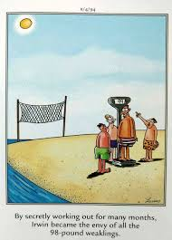

# The 98 pound weakling

When I started high school I was very skinny and didn't weigh much.  The guys in my class always made note of it and I would randomly get lifted up in the air by people who thought it was funny how light I was.

After my [hospitalization for pneumonia](1995-the-hospital.md) I weighed even less.  I don't remember what my weight was, but I know my doctor was focused on me gaining weight.

Finally, towards the end of my 9th grade year, I reached 99 pounds.  The next day, I found the following comic posted on my locker:

It was around that time that I hit my growth spurt and I went from being on the shorter side to being the tallest in my family.
